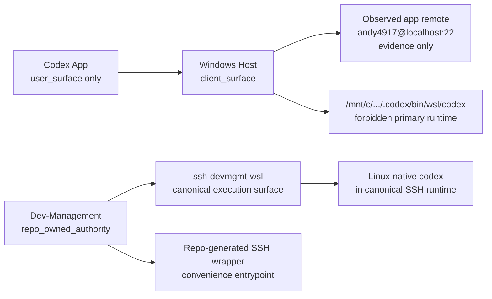

# Global Runtime Architecture

## Goal

Separate user and app surfaces from runtime authority.

- Codex App is a user surface only.
- Windows host is a client and UI surface only.
- Dev-Management is the source of truth.
- `ssh-devmgmt-wsl` is the canonical execution surface.
- Windows-mounted Codex launchers are external dependencies and are forbidden as the primary runtime.

## Current vs Desired

## Surface Roles

- `codex_app`: `user_surface`
- `windows_host`: `user_surface` and `client_surface`
- `windows_codex_state`: live runtime surface, not authority
- `windows_codex_launcher`: external dependency, forbidden primary runtime
- `wsl_linux_shell`: local execution surface for diagnostics
- `ssh_devmgmt_wsl`: canonical execution surface
- `dev_management`: repo-owned authority and source of truth
- `dev_workflow`: workflow and runtime support repo
- `reservation_system`: application repo
- `serena`: startup gate
- `context7`: protected-change gate
- `git_windows` and `git_wsl`: git surfaces that can drift independently

## Resolution Order

Allowed primary resolution order:

1. Linux-native `codex` inside the canonical SSH runtime
2. Repo-generated local SSH wrapper

Forbidden:

- `/mnt/c/Users/anise/.codex/bin/wsl/codex` as primary runtime
- `/mnt/c/Users/anise/.codex/bin/wsl` in authoritative PATH
- `.codex/tmp/arg0` front-loading the effective runtime

## Runtime Contracts

- `contracts/workspace_authority.json` defines the authority model.
- `contracts/execution_surfaces.json` defines surface mismatch, path contamination, and precedence rules.
- `contracts/instruction_guard_policy.json` defines PASS, WARN, and BLOCKED instruction outcomes.
- `andy4917@localhost:22` is recorded as observed remote evidence only and must not be promoted to canonical authority without validation.

## Repair Boundaries

Repo-owned repairable surfaces:

- generated reports
- generated preview wrappers
- generated mirror files explicitly owned by authority
- local generated wrappers, but only after canonical readiness passes

Not repairable by the repo:

- Windows Codex app binaries
- `/mnt/c/Users/anise/.codex/bin/wsl/codex`
- Windows PATH
- SSH private key permissions
- Windows Git global or system config
- `/etc/wsl.conf`

## Generated vs User Override

- Generated files carry an authority path, generated header, or explicit authority ownership and are repairable.
- User-level live overrides are report-only drift unless explicitly declared repo-owned.
- `~/.codex/config.toml` is the generated Linux runtime mirror.
- `~/.codex/user-config.toml` is the optional L1 user override surface.
- Generated config must not feed itself back in as an override source.

## Guard And Audit Rules

- Audit checks live `command -v codex`, `type -a codex`, and PATH precedence on every run.
- Shim text alone is not enough. A correct-looking shim with a forbidden live resolution still yields `BLOCKED`.
- When authority declares `ssh-devmgmt-wsl`, auto mode is fail-closed. Local contaminated runtime is diagnostic only and never becomes execution authority.
- When canonical SSH execution is PASS, Codex App session PATH contamination is reported as a client-surface `WARN`, not as execution-authority failure.
- Local shell execution remains `BLOCKED` whenever the live resolution or wrapper target still routes through a forbidden Windows-mounted launcher.
- Repair apply must remain staged until canonical SSH readiness, local PATH precedence safety, tests, and `git diff --check` all pass.
